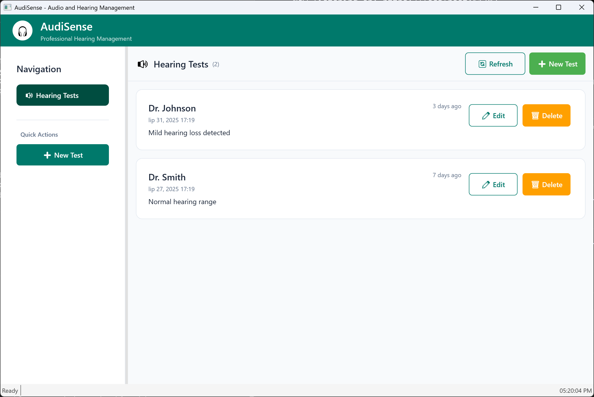
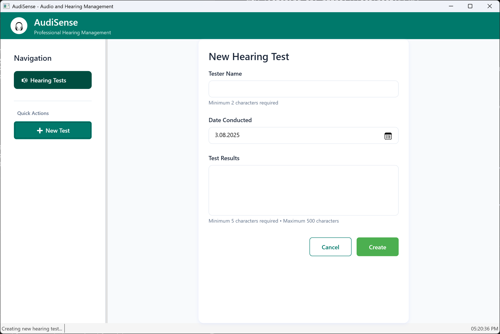

# AudiSense - Application Business Description

## Overview

**AudiSense** is a comprehensive desktop application designed for professional audio and hearing management. This robust WPF-based application provides an intuitive user interface for conducting and managing hearing tests efficiently in professional healthcare and audiological environments.

## Business Features

### Core Functionality

#### 1. Hearing Test Management
- **Create New Tests**: Comprehensive form-based interface for recording hearing test data
  - Tester name (required, 2-100 characters)
  - Date conducted (required)
  - Test results (required, 5-500 characters for detailed documentation)
- **View Test History**: Organized list view displaying all recorded hearing tests
- **Edit Existing Tests**: Modify previously recorded test data to maintain accuracy
- **Delete Tests**: Remove outdated or incorrect test records
- **Real-time Status Updates**: Live feedback on application operations

#### 2. User Interface & Experience
- **Professional Dashboard**: Clean, modern interface optimized for healthcare professionals
- **Accessibility-First Design**: Built with accessibility standards for users with varying abilities
- **Responsive Navigation**: Side panel navigation with quick action buttons
- **Visual Status Indicators**: Clear feedback for loading states, empty states, and user actions
- **Keyboard Navigation Support**: Full keyboard accessibility for all interactive elements

#### 3. Data Management
- **Structured Data Storage**: Organized storage of hearing test records with validation
- **Real-time Data Refresh**: Automatic updates and manual refresh capabilities
- **Data Validation**: Input validation with helpful error messages and field requirements
- **Chronological Organization**: Tests displayed by date with "days ago" indicators

### Application Screenshots

#### Home Page Dashboard

The main dashboard provides:
- Professional branding with AudiSense logo and subtitle
- Side navigation panel with quick access to hearing tests
- Central content area for displaying test lists and forms
- Status bar for system feedback
- Quick action buttons for common tasks

#### Add New Hearing Test Form

The hearing test form features:
- Clean, card-based layout for professional appearance
- Required field validation with helpful guidance text
- Date picker for accurate test date recording
- Multi-line text area for detailed test results
- Clear action buttons (Cancel/Save) with appropriate styling
- Accessibility-compliant form labels and structure

## Technical Architecture

### Current Technology Stack
- **Frontend**: WPF (Windows Presentation Foundation) with .NET 9
- **Architecture**: MVVM (Model-View-ViewModel) pattern
- **Data Access**: Entity Framework with repository pattern
- **API**: RESTful services with proper HTTP semantics
- **Dependency Injection**: Built-in .NET DI container

### Key Business Entities
- **HearingTest**: Core entity containing tester information, test date, and results
- **Validation Rules**: Comprehensive input validation for data integrity
- **Status Management**: Real-time feedback and error handling

## Migration Success Criteria

For successful technology migration to Blazor WebAssembly, the new application must:

1. **Preserve User Experience**: Maintain the visual design and user workflow shown in the screenshots
2. **Retain All Features**: Support all current hearing test management capabilities
3. **Enhance Accessibility**: Improve upon current accessibility features for web standards
4. **Maintain Performance**: Ensure responsive interactions and data operations
5. **Cross-Platform Access**: Enable access from various devices and browsers while maintaining professional appearance

## Target Users

- **Audiologists**: Professional hearing specialists conducting patient tests
- **Healthcare Administrators**: Staff managing hearing test records and data
- **Medical Assistants**: Support staff entering and maintaining test data
- **Users with Disabilities**: Application designed with full accessibility support

## Business Value Proposition

AudiSense streamlines hearing test management by providing:
- **Efficiency**: Quick test entry and retrieval reduces administrative overhead
- **Accuracy**: Structured data entry with validation prevents errors
- **Accessibility**: Inclusive design supports diverse user needs
- **Professional Presentation**: Clean interface maintains clinical professionalism
- **Data Integrity**: Comprehensive validation and status feedback ensure reliable records

---

*This document serves as the foundation for technology migration planning, ensuring that all business features and user experience elements are preserved during the transition from WPF desktop to Blazor WebAssembly web application.*
